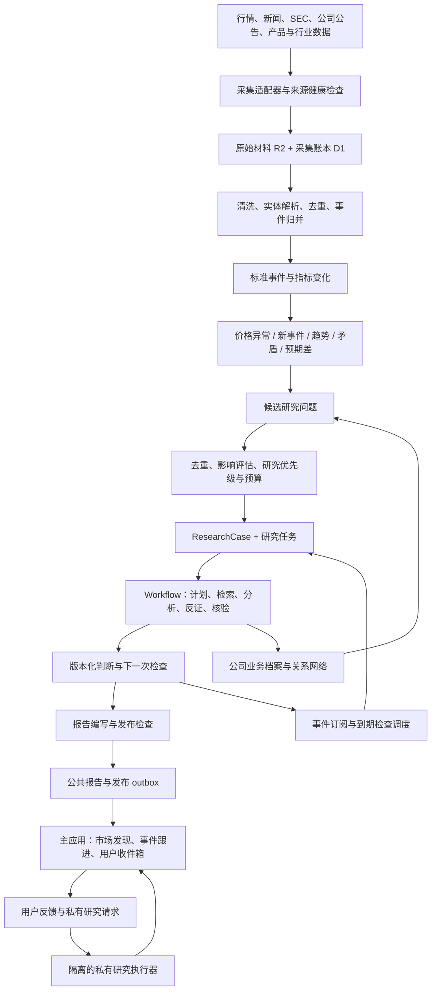

# Spontra 自主市场研究系统架构

状态：架构设计，尚未实现或启用后台监控。日期：2026-09-25。

## 1. 目标与关键决定

系统持续观察市场，在用户没有提问、没有持仓、也没有预先关注某家公司时，主动发现值得研究的问题；收集证据、分析商业影响、关联其他公司，形成报告，并在后续证据出现时更新判断。

核心产物是有生命周期的 **ResearchCase（研究问题）**。新闻、行情、财报是输入，报告是某个时点的研究结果。报告发布不代表问题已经解决。

本设计采用以下决定：

1. 全局研究先发现市场问题，用户偏好和持仓只影响最终分发优先级。全局发现不能被持仓名单过滤。
2. 同时运行快速异常检测、日常主动发现、未解决问题复查三条循环。没有价格异动时也应能发现问题。
3. 用规则与统计方法处理高频观测，模型负责提出问题、规划查证和解释商业机制。调度、预算、权限、数据计算和发布约束由代码执行。
4. 关系网络帮助检索；模型可以提出网络中原本不存在的关系，但必须作为假设查证。关系网络不被当作因果真相。
5. 公共证据、研究问题和公共报告进入独立 Research 服务；用户身份、阅读记录、持仓和私有讨论留在主应用。
6. MVP 使用 Workers、Queues、Workflows、D1、R2；关系先用关系表表达，不引入专用图数据库。需要语义召回时增设可重建的向量索引。
7. 每次研究是有预算、有终止条件的短任务；持续性来自数据库保存的问题、待办和调度，而不是无限运行的模型对话。
8. 分钟级检测先落地。实际时效受数据源授权、延迟、覆盖范围约束，系统必须展示覆盖与数据时间。

### 覆盖范围

第一阶段建议覆盖 500–1,000 家流动性较好的美股公司及其相关行业、产品、私营公司、项目、监管机构。候选公司范围来自证券目录与业务关系，和用户是否持有无关。遇到范围外的重要实体允许自动建立候选档案并排队补全；新增数据供应商、付费套餐和高成本采集权限由配置控制。

这里的“全市场发现”指不以持仓为边界；上线必须同时公布实际覆盖市场、公司数、数据源和盲区，不能把首期范围描述成全球无遗漏。

### 成功后的用户体验

- ORCL 异常下跌：先收到价格事实与查证状态；获得新证据后，同一研究问题补充原因及反证。
- 某款 Agent 产品增长：即使新闻没有提到 Google，系统也能提出“商业搜索需求是否迁移”的问题，找出相关公司，核验并汇报。
- 几周内多家公司出现相同经营变化：系统识别共同趋势，生成行业问题，而不需要等待一条爆炸性新闻。
- 旧判断被新材料推翻：主动更正并解释发生了什么，保留此前版本。
- 没有足够重要的新发现：不为每日数量指标凑报告。

## 2. 当前系统能复用什么

以下是本地源码核对结果，不是生产运行验收。

| 现有模块 | 可复用基础 | 本方案需要补足 |
| --- | --- | --- |
| `workers/pipeline/src/worker.ts`、`core.ts`、`wrangler.jsonc` | 已有 SEC、Memory、公司分析、基本面调度；当前配置每 10 分钟触发 | SEC 执行受配置 ticker 范围限制，缺少覆盖市场的信号发现与统一研究任务 |
| `workers/pipeline/src/sec/discovery.ts` | 从文件片段提取有原文位置的重大披露、重要性及问题 | 将单份文件里的发现汇入跨来源、跨公司的问题池 |
| `workers/pipeline/src/workflow-core.ts`、`operations.ts` | 耐久任务、模型调用、财报发布和失败恢复 | 新增独立研究轮次；8-K/6-K 摘要发布需显式触发研究事件，不能假定会自动走周期财报 Memory 路径 |
| `workers/pipeline/src/sec/memory.ts`、`memory-workflow.ts` | 判断带证据、期限、下一次核验及证伪条件 | 公共跨公司 ResearchCase、版本化假设、事件订阅、跟进计划 |
| `workers/pipeline/src/company-analysis/feature-engine.ts` | 校验财务观测属于当前公司，避免指标串公司 | 保留这项校验；跨公司研究读取各公司独立证据包后比较，无须破坏财务数据归属 |
| `workers/pipeline/src/web-search/`、`docs/web-search.md` | 供应商适配、D1/R2 缓存、租约、权限 scope、有限重试 | 当前模块存在不等于已有持续新闻流；新增研究调用方、新闻增量采集、采集覆盖记录 |
| `lib/yahoo-quotes.ts`、`app/use-market-quotes.ts` | 页面行情展示和日期信息 | 请求的日线序列不能用于分钟级异常基线；需要后端盘中时间序列与可靠数据合同 |
| `app/daily-reports-home.tsx` | 报告阅读及回复交互原型 | 当前仍为 `sampleReports` 与页面内状态，需要真实报告、阅读记录及回复触发任务 |
| `docs/product-vision.md` | 持续研究、反证、主动汇报的产品基础 | 本次用户要求将发现范围扩展到未持有、未关注的市场公司 |

已有分析数据库继续由 Pipeline 单独写入。Research 服务通过受控读 API 和显式发布事件接入，不直接改 SEC 财报表，也不把自己的推断写成 SEC 原始事实。

现有源码边界检查禁止 Pipeline 回调 Web。新增发布事件由 Pipeline outbox 写入独立 Queue，Research 消费；不能借机恢复旧的 Web 内部回调。Research 和主应用通过新声明的服务消息合同连接，边界检查随之扩展，而非让 Web 导入研究服务实现。

## 3. 总体数据流



图中的私有执行器属于后续阶段，复用研究代码但使用独立数据与权限。MVP 的回复仅保存为主应用私有反馈/订阅。私有研究请求不可自动回流为公共关系或公共报告。

## 4. 输入与数据质量

### 4.1 数据合同先于检测承诺

| 输入 | MVP 接入方式 | 主要用途 | 需要保留的信息 |
| --- | --- | --- | --- |
| 股价、成交量、交易状态、公司行动 | 有授权的分钟 bar / 批量快照；后续可接流式数据 | 检测突变、市场与行业相对走势 | 交易所/feed、市场时段、行情时间、是否延迟、复权基准、修订状态 |
| SEC 文件 | 官方公司 submissions 分片轮询并抓取原文；低延迟需求可接授权聚合流 | 新申报、经营变化、重大合同/融资/诉讼 | CIK、accession、form、接受时间、披露时间、正文哈希 |
| 新闻流 | 有许可的结构化新闻增量接口或 webhook | 首次获知、确认、修订、撤稿 | 供应商 ID、原始媒体、作者、首发与更新时间、上游转载链 |
| 公司 IR、产品公告、电话会 | 官网增量、日历驱动抓取与按需搜索 | 核验媒体线索、管理层承诺 | 原始文件、会期/财期、原文位置、材料完整性 |
| 采用与行业指标 | 有可比口径的榜单、流量、价格、行业统计等 | 缓慢变化与跨公司问题 | 指标定义、样本、测量范围、频率、缺失原因 |
| 宏观、监管、产业事件 | 官方发布日历、文件、可靠新闻流 | 共因分析和跨行业影响 | 发布时点、参考期间、修订版本、地区/行业 |
| 用户提出的问题 | 主应用授权入口 | 私有或显式共享的研究 | 用户 ID、权限范围、原始提问和约束 |

SEC 的公开 submissions API 与 XBRL API用途不同：新文件发现先用 submissions，不等待结构化财务数据。公司级 1,000 次请求若每分钟执行会产生约 16.7 次/秒请求；不能把小规模轮询方案直接扩大。首期采用分片轮询、全服务共享限速、条件请求及增量检查；现有 Pipeline 也计入相同 SEC 出口预算。官方接口来源见 [S1]、[S2]。

盘中行情建议先对比 Alpaca 与 Massive 等候选的覆盖、商业使用/再展示许可、分钟修订、历史回放及授权费用后选定一家。IEX、SIP 与 delayed SIP 的覆盖和延迟不同；不能混为同一种行情。Alpaca 文档明确支持迟到成交导致的 `updatedBars`，检测器必须处理修订 [S3]。供应商接口存在不等于当前账号拥有该数据权限。

### 4.2 一份材料和一个事件分开存

同一通知被五家媒体转载，应形成五份来源材料、一个事件簇，并记录共同的原始来源。五篇转述不等于五个独立确认。

- **SourceDocument**：实际取得的文档及其版本。
- **Event**：现实中发生或被报道的变化，允许待确认、纠正、撤回。
- **Observation**：某时点的数值或被明确归属的表述。
- **Claim**：对现实的可核验主张，例如“公司下调了全年指引”。
- **Hypothesis**：需要验证的机制，例如“交付延迟可能推迟收入确认”。

去重分三层：供应商事件 ID / accession 的精确去重；URL、正文哈希及出处去重；主体、动作、对象、时间、地区构成的事件归并。语义模型只能提出合并候选，低置信度实体和含义相反的修订必须保留。不要把公司同名、ticker 变更、ADR、不同股类当成同一证券。

### 4.3 时间和授权必须随证据传播

至少区分 `occurred_at`（事件时间，可未知）、`published_at`、`first_observed_at`、`retrieved_at`、`effective_at`、`superseded_at`。记录模型、提示、检测器与数据版本。历史回放只能使用截止时点已取得的版本。

证据还必须记录授权范围、可否缓存全文、可否再展示及保留期限。R2 保存权限允许的原文、摘要或来源记录；不能因为网页可访问就默认可以公开全文。

采集失败、来源暂时缺失、材料被截断都要变成显式数据质量状态。“没有抓到新文件”只说明本次覆盖内没有取得文件，不等于公司没有发生变化。

## 5. 主动发现如何运作

### 5.1 五类候选生成器

| 生成器 | 触发材料 | 自动提出的问题 | 防止误判的约束 |
| --- | --- | --- | --- |
| 异常与新事件 | 急跌、异常成交、重大披露、产品发布、政策变化 | 哪个机制可能解释变化？哪些公司受影响？ | 修正公司行动、数据陈旧、交易时段和大盘共因 |
| 缓慢趋势 | 数周采用、价格、交期、招聘或渠道指标 | 是否出现行业结构变化？ | 使用一致口径、多期样本；一次榜单不能证明持续采用 |
| 证据矛盾 | 管理层承诺与实际交付、客户与供应商披露冲突 | 哪个前提可能失效？ | 对齐时间、产品范围、币种与定义，不能把口径差当矛盾 |
| 预期与结果偏离 | 先前明确指引/预测与后续数据 | 哪项可测量预期没有兑现？ | 没有带日期的基准不能声称“超预期”或“市场未定价” |
| 跨公司机制迁移 | 某种新行为、技术、约束或盈利方式 | 谁的入口、成本、定价权、资本效率会受影响？ | 每条推理给出中间变量、条件、反例和观察指标 |

价格只是一种入口。采用趋势、监管改变或合同条款可以在股价尚未反应时发起研究；这不代表系统已经证明存在可交易的超额收益。

### 5.2 检测器的具体计算

价格检测同时观察日涨跌、5/15 分钟收益、相对市场/行业收益、同一交易时段的成交量异常。优先使用复权一致的可成交行情，并处理停牌、拆分、除权、缺 bar、迟到修订和不同市场时段。

```text
窗口收益 = 当前有效价格 / 窗口起点有效价格 - 1
简单相对收益 = 公司窗口收益 - 行业窗口收益
标准化偏离 = (当前相对收益 - 历史可比窗口均值) / 历史可比窗口波动
相对成交量 = 当前窗口成交量 / 历史同一时段窗口成交量基线
```

首版可以用简单相对收益，后续在有足够历史数据时加入历史估计的市场/行业 beta。基线只使用当时已经取得的历史数据，不能把本轮极端值先纳入再检测。简单差值、beta 残差均只是异常指标，不是因果解释。

初始阈值可采用日跌幅 4%、15 分钟跌幅 2% 或相对收益超过 3 个可比标准差作为候选，并要求最小成交与数据新鲜度；阈值按流动性、波动率与市场时段回放校准。这些阈值只触发调查，不直接产生利空判断。极端变化可立即触发；较弱变化需持续两个有效观察窗口。候选默认冷却 30 分钟，严重程度升级、新原始证据或更正可以突破冷却。

趋势检测使用滚动变化率、斜率和变点候选，在至少达到指标自身最低样本量后运行；对发布日期、季节性和统计口径变化单独标记。缺失数据不能补零。矛盾检测先将主张对齐到相同主体、业务范围、期间和指标，再比较方向/数值；模型负责识别需要核验的冲突，代码负责数值和时间对齐。

### 5.3 候选生成不是每天对所有公司提问

采用逐层筛选：原始输入 → 数据质量检查 → 低成本去重/规则 → 事件簇或趋势特征 → 有限模型候选 → 研究任务。每批事件最多生成少量问题，模型必须允许输出空数组。

单个候选必须具有：

```ts
type DiscoveryCandidate = {
  triggerIds: string[];
  question: string;
  affectedEntityIds: string[]; // 可以含未持有公司、产品、行业或项目
  mechanism: string;
  changedPremise: string;
  supportingEvidenceIds: string[];
  missingEvidence: string[];
  alternativeExplanations: string[];
  falsifier: string;
  horizon: string;
  noveltyAgainstCaseIds: string[];
  proposedNextCheck: string;
  discoveryPath: "known_relation" | "business_retrieval" | "open_exploration";
};
```

“Google 将受到 AI 冲击”过于宽泛；“购物 Agent 是否减少美国高商业意图的搜索，并影响搜索广告变现”能够研究。问题至少要说明主体、机制、市场/业务范围、时间跨度和可观察的变化。

### 5.4 三条关联路径同时运行

1. **已知关系**：从已核验的客户、供应商、竞争、产品、项目、地区敞口寻找直接与有限间接受影响实体。初始限制最多两跳，再依据证据和预算决定是否深入。
2. **商业机制检索**：按“靠什么收钱、客户为什么付钱、依赖哪个入口/资源/许可”检索公司业务档案。这样一条只点名 Meta 的新闻，也可能召回 Google，而不需要媒体提前提到 Google。
3. **开放探索**：固定保留一部分研究预算，让模型提出档案中尚未保存的候选实体/关系，再从原始来源核实。这解决新公司、新产品和不在既有图谱中的关联。

向量相似度用于找候选，不能直接证明经济联系。已有关系扩散每一步都要返回具体关系、适用时间和来源；开放探索允许提出缺少桥接证据的 `proposed` 关系，但须列出缺口，只能进入受限查证，不能当作已成立关系继续自动放大影响。“都属于科技股”不足以进入深度研究。

### 5.5 排序与研究预算

全局研究排序考虑：潜在经营影响、证据可靠程度、变化幅度、新颖性、可验证性、时效性、影响范围、验证所需成本。模型可解释重要性，但不能独自决定预算与发布。

首期可用以下可调整配额做 shadow run：每日筛出约 100 个候选，研究 20–40 个问题，深入 5–10 个，最终汇报 0–5 个；重大事件和更正独立处理。这些是容量配置，不是内容配额和效果承诺。

研究预算初始分配示例：50% 新事件、25% 已有问题复查、15% 开放探索、10% 重试与紧急预留。超出预算时排队或发布事实快报并标明分析未完成；不得静默丢失重要事件。

优先级和截止时间防止冷门问题永远排不上；每日检查覆盖盲区，避免只研究新闻最多的大公司。用户持仓不进入全局候选准入条件。个性化排序发生在公共报告产出之后，同时保留市场新发现曝光。

下一次搜索优先选择最能区分竞争解释的证据。例如已经有十篇讨论“Agent 威胁搜索”的文章时，再读一篇评论价值有限；留存、商业任务占比、是否绕过搜索或变现数据更能改变判断。记录每次检索预计要解决的缺口及实际增量，避免检索量成为研究质量的替代指标。

## 6. 商业关系和可检验机制的存储

实体类型包括：公司、证券、业务分部、产品、客户群、项目、国家/地区、监管机构、指标。公司和证券分开，业务分部可以连接多个产品及市场。

关系包括：`owns`、`sells_to`、`supplies`、`competes_for`、`depends_on`、`distributes`、`regulated_by`。每条关系必须带证据、适用期间、地理/产品范围和状态。

机制使用独立节点表达条件与多个前提，而不是强行简化成一条“Meta 打击 Google”的边。例如：

```text
机制：商业意图迁移
前提：用户持续使用 Agent 完成原本经由搜索完成的购物任务
中间变量：商业查询次数、平台选择、任务完成率、获客渠道
潜在结果：搜索广告机会、成交分成、商家获客成本变化
可能涉及的实体：产品、广告平台、电商平台、支付与商家
成立条件：用户采用持续、任务成功、商家允许访问、商业化可行
反向路径：原平台提供同样能力并保持分发、用户关系和变现
状态：proposed / supported / mixed / contradicted / unresolved
```

初期采用 D1 的实体、关系、机制、证据映射表，配合 SQL 查询和业务文本检索即可。向量索引是召回加速器，可从已授权文本重建；只有在真实查询量和路径复杂度证明必要时再引入专用图数据库。

保存模型提出的关系时使用 `proposed`。有原文证据的客户关系可以成为事实关系；商业因果机制通常只能被证据支持或挑战，不自动升级成确定因果。

所有修改保留版本和失效时间。来源撤回时，通过依赖关系找到受影响的主张、问题和报告，触发复查与更正。

初始业务档案从公司最新年度披露、分部说明和产品/商业化官方资料构建，分别保存收入模式、客户、渠道、成本、资源约束及业务暴露，并引用原文。新事件增量刷新相关字段，定期扫描长期未更新档案。未覆盖的新实体先建立最小身份及业务描述，再决定是否支付完整研究成本，避免“先把全世界图谱建完”成为启动条件。

## 7. 研究工作流与终止条件

每个研究轮次由一个 Workflow 执行，下列角色是按需调用的任务，不要求每个问题都启动一套固定的 Agent 对话。

| 步骤 | 产物 | 执行与限制 |
| --- | --- | --- |
| 1. 合并输入 | 事件簇、已有问题、同一版本输入包 | 代码去重；对同一问题取得有期限的研究租约 |
| 2. 规划 | 有限研究步骤、证据缺口、竞争解释、停止条件 | 模型规划，代码校验工具白名单、搜索次数、期限、费用 |
| 3. 收集 | 原始来源及合法证据片段 | 优先原始材料，公开网络搜索用于补缺；记录零结果与抓取失败的区别 |
| 4. 分析 | 主张、机制路径、估计及假设 | 数值由确定性代码计算；模型不能创造未取得的数据 |
| 5. 反证 | 最强竞争解释、推翻条件、关键缺口 | 重点问题必须主动搜反例；同源转载和另一个模型同意不构成独立确认 |
| 6. 验证 | 每个关键主张的证据支持状态 | 校验证据实际存在、是否支持句子、时间是否匹配、来源独立性、单位和统计口径 |
| 7. 决定 | 发布、降级为待核验问题、补查、暂停、关闭 | 有限补查；建议最多 2 轮修复，之后显式保留不确定性 |
| 8. 提交 | 判断版本、报告草稿、后续计划 | 条件提交，拒绝过期 lease 或已被新版本替代的研究结果 |

模型不得把以前的自动报告、图谱中的推断或模型常识当作新的独立证据。旧报告帮助理解“当时怎么判断”，支撑现实主张仍需追到原始来源。

每轮预算包括：模型 token/费用、付费搜索次数、正文抓取数、最大关联候选数、墙钟时间、最大修复次数。停止原因需可审计：证据足够、信息无法取得、预算用尽、输入被替代、上游失败。

启动任务和每次付费调用前，按 `run_id + step_id + attempt_id` 原子预留全局、队列类别、单问题预算；成功后以实际用量结算。多个 Workflow 不能通过分别读取余额绕过总额。网络超时且可能已计费时保留 uncertain reservation，并记录供应商 request ID 等待核对，不能立即释放再无限重试。

每轮冻结不可变输入清单：`case_base_revision`、事件/文档 revision、正文哈希、关系版本、证据截止时点。检索取得的新材料追加为显式增量清单。步骤按版本和哈希读取，避免重试时悄悄取得后来更新的材料。

租约包含 `run_id / lease_owner / expires_at / fencing_token`，每次重新占用递增 fencing token。Workflow 恢复可能复用已完成步骤结果，所以取得租约不能仅作为一次可缓存的首步骤。每次尚未执行的付费调用前重新校验并续租，检查取消标志；所有结果和最终提交校验 fencing token。失去租约立即停止，已取得的中间材料可保存为该旧 run 的审计记录但不可成为当前判断 [S12]。

快报可以只说明已确认的价格/事件事实及正在调查的问题，无需等待完整归因。若证据只足以提出问题，报告就呈现问题，不强行给出方向结论。

## 8. 持续研究与调度

### 8.1 四组状态独立保存

| 维度 | 状态示例 | 含义 |
| --- | --- | --- |
| 任务执行 | queued / running / waiting / succeeded / failed / canceled | 这次研究轮次是否完成 |
| 问题生命周期 | candidate / active / watching / dormant / resolved / closed | 该问题是否仍值得跟踪 |
| 假设证据状态 | untested / supported / mixed / contradicted / unresolved | 当前证据如何影响判断 |
| 报告与投递 | draft / published / corrected / retracted；pending / accepted / failed | 内容是否发布、渠道是否接收 |

工作流 succeeded 不等于假设 supported；报告 published 不等于问题 resolved；通知 accepted 不等于用户已阅读。

问题去重使用规范键候选：`机制 + 参与者角色 + 业务/地区/客群范围 + 时间跨度`，再比较问题与证据。标题相似仅用于召回，判断方向不作为身份键，反证仍回到同一问题。同一问题的新增事实写入既有 case；范围扩大时保存 `derived_from / parent_case / related_case`。合并保留旧 ID 重定向与全部报告，拆分保存子问题及订阅迁移记录；关闭问题收到相关实质证据时可以重开。不得仅靠一个通用“AI 替代”主题把独立问题混为一案。

### 8.2 两种唤醒方式

- **新证据唤醒**：事件经实体、机制、指标及问题订阅索引路由到相关 ResearchCase。
- **到期唤醒**：调度器读取 `next_check_at`，复查具体问题；没有新证据可以记录本次覆盖与检查结果，延后下一次核验。

同一问题在短时间内收到多个事件先合并；已在研究时累积 pending input version，当前轮次结束后判断是否需要新一轮。普通新输入不让正在执行的研究无限重新开始；报告注明冻结截止时间。撤稿、更正或严重失效证据提高 `invalidation_epoch` 并取消旧发布资格。发布时同时校验 case 的基础判断版本、invalidation epoch、租约及依赖证据的撤回状态。不能同时运行多份内容相同的研究。

建议节奏是策略默认值，可按来源成本与问题期限调整：

| 情况 | 节奏 |
| --- | --- |
| 常规交易时段价格扫描 | 每分钟批量处理；前后市使用独立流动性标准 |
| 新重大事件 | 立即排队，随后 15 分钟、1 小时、收盘进行有目标的检查 |
| 公司回应、SEC 新文件、新闻撤稿 | 不受普通去重冷却限制，立即复查相关问题 |
| 产品采用和行业趋势 | 日度更新，周度比较，按真实数据发布频率调整 |
| 指引、订单兑现、资本开支回报 | 财报/电话会等预期披露时点检查，日常监听相关重大事件 |
| 长期无进展 | 降频进入 watching/dormant；记录原因和重新激活条件 |

市场日历使用 `America/New_York`、交易所节假日和提前收市时间。调度配置按 UTC 执行，运行时根据市场日历判定，不把固定北京时间当作全年开收盘时间。

长期问题放在 D1 与后续任务表。Workflow 负责一轮执行，不承担永久研究记忆。

## 9. 报告与用户分发

### 9.1 报告结构

每份报告至少回答：发现了什么、为什么现在值得注意、涉及谁、商业影响通过什么路径传递、有哪些支持与反对证据、尚不知道什么、下一步何时核验。

建议统一结构：

```ts
type ResearchReport = {
  reportId: string;
  caseId: string;
  revision: number;
  kind: "flash" | "investigation" | "market_discovery" | "update" | "correction";
  asOf: string;
  title: string;
  finding: string;
  whyNow: string;
  affectedEntities: Array<{ entityId: string; mechanismPathId: string }>;
  claims: Array<{
    claimId: string;
    text: string;
    status: "confirmed" | "reported" | "inferred" | "unknown";
    evidenceIds: string[];
    counterEvidenceIds: string[];
  }>;
  changedSinceLastReport: string[];
  openQuestions: string[];
  nextChecks: Array<{ question: string; trigger: string; dueAt?: string }>;
  coverage: { sourceCutoff: string; missingSources: string[]; delayedInputs: string[] };
};
```

区分“新发现”“判断更新”“事实更正”。若同一事件只是重复报道，更新内部采集记录即可；只有关键证据、影响范围、判断方向或待办发生实质变化才再次提醒。

“未持有”公司可以进入日报、重大主题报告和问题订阅。用户可以回复“继续跟踪这条”“研究另一种解释”“减少这个主题”。MVP 将回复保存在主应用，调整私有关注/反馈；私有执行通道上线后才据此形成有期限的深度研究任务。阅读行为不等于接受结论，不自动改写用户投资原则。

### 9.2 公共研究与个人上下文

公共报告产出后，主应用根据公开主题订阅、用户兴趣、持仓和通知偏好选择分发。持仓影响可作为私有附加段生成，不嵌入公共报告。

本文“公共研究”指在相同内容授权范围内可跨用户复用，不意味着匿名开放，也不意味着供应商原文可对所有用户展示。付费来源授权、报告可读权限和正文引用许可分别检查；授权受限材料即使研究结论可共享，也只展示允许披露的摘要和引用。

公共市场发现应有独立入口；即使用户没有持仓、没有设置关注列表，也能看到重要新问题。用户反馈可以调节个人分发，但不能让单个用户的持仓偏好改变公共事实结论。

当前项目文档明确尚未具备完整的个人身份与隔离边界。上线私有收件箱、持仓关联或外部通知前，必须先实现受保护的 owner 身份或完整 tenant 身份、授权及数据隔离。Research Worker 不绑定私有账本数据库。

私有深度研究上线时，增加 `spontra-private-research` 执行入口，复用纯研究模块但绑定独立 `PRIVATE_RESEARCH_DB / PRIVATE_RESEARCH_ARTIFACTS` 与私有队列；不能写公共关系、case 或报告。用户提示、检索结果、运行日志和缓存 key 均由可信后端选择 tenant scope，API 检查对象所有权。需要的持仓字段由主应用授权提供最小快照，不直接绑定账本。私有任务可读取有权访问的公共研究；只有经明确共享流程及内容权限检查的产物才能成为公共输入。

外部推送由用户开启相应渠道后执行。第一版先支持站内真实报告和持久化已读；外部渠道后续接入同一投递接口，不另写一套研究链路。

### 9.3 发布检查

代码强制检查：来源和关键主张可定位；数字单位/时间一致；推断有标签；没有将转载当独立证据；没有把同日相关直接写成确定因果；个人内容权限正确；报告有实质新变化；缺失来源显式披露。

语义核验模型检查“证据是否真的支持句子”和“是否存在更强反例”，但不能用单一模型自评分替代质量保证。重要或高不确定问题可进入人工审核模式；常规通过检查的报告按已配置发布策略自动进入站内。

## 10. Cloudflare 运行结构

### 10.1 服务边界

```text
spontra（已有主应用）
  身份、私人账本、个人订阅、收件箱、阅读状态、私有回复、UI
  接收公共报告发布事件；按权限读取报告

earning-report-analysis-sec-pipeline（已有）
  独占原分析 D1/R2 的写入
  对外提供已发布分析的受控读 API
  新增 published / corrected 事件 outbox

spontra-research（新增）
  scheduled：采集轮询、趋势扫描、问题复查、outbox 补投
  queue：标准化、发现调度、研究任务、公共报告发布
  workflows：EvidenceCollection / CaseResearch / ReportAssembly 的有界轮次
  RESEARCH_DB：公共实体、事件、问题、研究与发布账本
  RESEARCH_ARTIFACTS：有授权的原文、证据包、版本化报告
  可选语义索引：公共且有权索引的公司业务描述和证据

可选 streaming-adapter（后期）
  有监督的外部数据连接、重连、心跳、序列/游标、缺口回补
  输出批量分钟特征和标准事件，不把每个 tick 发给模型

可选 spontra-private-research（个人深度研究阶段）
  复用研究算法，独立私有 DB/R2/Queue，所有对象验证 tenant
  只读已授权公共研究；私有结果回到对应用户收件箱
```

第一版将 Research 采集、队列处理、Workflow 类按模块拆分，可部署在同一个新 Worker；分队列和并发配额隔离高优先任务。实际吞吐或外部通知密钥隔离需要时，再拆采集或投递 Worker。

Cloudflare Cron 适合周期任务，Queues 用于异步缓冲与重试，Workflows 保存多步执行进度 [S5–S9]。Durable Objects 可以用于协调器或限速器，但不是 MVP 的必需组件。

### 10.2 真正流式行情的边界

优先选择提供 webhook 或满足时效的批量数据接口。若接入供应商 WebSocket，需一个可监督、能恢复连接的适配进程，以及持久游标、断线检测、REST 回补与去重。

不能假定 Worker 一次启动后能永久保持上游连接；DO 的 WebSocket hibernation 不适用于它作为客户端发起的上游 WebSocket [S10]。是否采用容器或其他运行方式，应在秒级需求和数据许可确定后单独验证。

分钟级 bar 足以覆盖首期研究提醒。若后续做秒级检测，只替换采集/特征层，事件、研究问题、核验和报告结构不变。

### 10.3 可靠投递与提交

Queues 按至少一次方式投递，且不保证顺序 [S6]、[S7]。以下路径都必须能重复执行：

1. 对有权保存的正文，先向 R2 写不可变对象并取得哈希。
2. 在同一 D1 原子提交中记录本批文档/事件引用、outbox 和对应 source cursor 推进；游标只能前进到已可靠保存的连续位置。连接器使用 cursor lease/CAS，旧采集器不能覆盖较新游标。非连续数据源保存已见 ID 与重叠回扫水位，定期用历史索引补漏。
3. Dispatcher 将 outbox 消息发送到 Queue，成功后标记已发送。
4. 发送成功但标记失败会导致重发；每条修订具有稳定 `message_id`，消费者使用 `message_id + consumer_version`（或 `event_id + revision + consumer_version`）唯一约束去重。不能只按 event_id 去重，否则修订/撤稿会被吞掉。当前版本指针按 revision 条件更新，撤回保存带版本 tombstone，迟到旧消息不能恢复已撤回内容。
5. 跨服务使用发送方 outbox + 接收方 inbox；接收消息与业务写入在接收数据库同一原子提交内完成。

R2、D1、Queue 之间没有统一事务，不宣称端到端 exactly-once。R2 写成功、DB 失败会留下孤立对象，可在宽限期后核对引用回收。不得先发布数据库引用再异步补写报告正文。

报告发布在同一 D1 提交中条件写入 report revision、更新当前可读版本、记录发布 outbox。条件包含 case 基础判断版本、fencing token、invalidation epoch 及依赖证据状态；不满足条件时整个业务提交不产生可见发布。D1 batch 提供事务语义，但 UPDATE 影响零行本身不自动让后续 SQL 回滚，因此所有发布写入必须共享有效的提交 guard，不能只检查第一条 UPDATE 后无条件插入报告 [S13]。主应用以 `report_id + revision` 幂等接收；阅读状态和投递记录不回写全局研究库。

模型/搜索网络请求有不确定失败时可能重复计费；存储已完成步骤、外部请求 ID 和预算记录，重试必须有上限。到期 lease 由修复扫描器恢复，旧执行者不能覆盖新版本。失败队列需要告警和明确重放流程 [S8]。

外部渠道若不支持幂等发送，发送超时可能已成功，重试仍可能重复提醒；记录 attempt 与 provider message ID 并明确该渠道的限制。站内报告、当前版本和阅读记录依靠数据库唯一约束避免重复。

## 11. 最小数据模型与接口

表名为建议命名，实施时再生成迁移。

| 表/对象 | 关键字段与职责 |
| --- | --- |
| `source_connectors`、`source_cursors` | 数据许可、覆盖、增量位置、最近成功、限流与健康状态 |
| `source_documents`、`evidence_spans` | 文档版本、来源谱系、R2 key、哈希、时间、原文片段/数值出处 |
| `entities`、`entity_aliases`、`business_profiles` | 公司/证券/产品身份、别名与业务描述，保留低置信度待核实体 |
| `observations`、`detector_states` | 指标定义、时点、修订、基线、最近异常状态；大量原始 bar 分区归档至 R2 |
| `events`、`event_documents` | 现实事件簇及各来源、修订/撤回、事件关系 |
| `claims`、`claim_evidence` | 独立主张、归属、支持/反对证据、取代关系 |
| `relations`、`mechanisms`、`mechanism_links` | 有时间和来源的事实关系、假设机制及多前提传导 |
| `research_cases`、`case_versions`、`case_links` | 稳定问题 ID、规范键、范围、状态、证据快照、当前判断版本、拆合关系与 invalidation epoch |
| `research_runs`、`research_steps`、`budget_reservations` | 输入清单、模型/提示版本、费用预留/结算、工具调用、停止原因、lease/fencing token |
| `case_subscriptions`、`followup_tasks` | 事件匹配条件、要验证的问题、期限、下一次检查时间 |
| `reports`、`report_revisions` | 冻结内容、证据、截止时点、变化摘要、发布/更正状态 |
| `outbox`、`consumer_inbox` | 稳定消息 ID、事件版本、重试、接收去重 |
| 主应用 `user_inbox`、`user_case_subscriptions`、`delivery_attempts` | tenant 权限、阅读、用户订阅、渠道响应；与公共库分开 |

所有主记录必须带 schema version；事件 envelope 至少包含 `message_id / event_id / event_type / entity_ids / occurred_at / observed_at / source_ref / revision / scope / trace_id`。使用 entity ID 表示现实实体，ticker 只是有生效时间的别名。

高频行情与大正文不写入 Workflow 参数或 Queue 消息，消息只传 ID、版本、R2 引用和小型元数据。以 1,000 只股票、常规交易日 390 分钟为例，每日约 39 万条分钟观测；按 21 个交易日约 819 万条。应批量存档并只把最新特征、检测状态和重要事件写入业务 D1，避免把高频采集直接变成逐条研究任务。

建议内部接口：

- `POST /internal/events`：服务间接收标准事件，鉴权、校验和幂等落库。
- `POST /internal/research-runs`：受预算控制的任务入口，调用方必须有相应 scope。
- `GET /api/v1/research/cases`、`GET /api/v1/research/cases/:id`：公共问题及其演变。
- `GET /api/v1/research/reports/:id`：读取指定修订及证据摘要。
- 主应用代理 `GET /api/research/inbox`、`POST /api/research/cases/:id/follow`、`POST /api/research/reports/:id/replies`：基于当前身份处理私有交互。

外部网页文本均作为不可信证据，不得修改系统工具权限、预算、通知对象或秘密访问。连接器 URL 策略、防止私网请求、响应大小和超时属于采集层责任。

## 12. 两条示例执行链

以下是设计回放示例，不是已部署行为，也不把用户提供的“爆火/暴跌”表述当成独立核验结论。

### A. ORCL 异常下跌

1. 行情质量通过后，检测器识别价格/成交异常，记录时段、前收盘基准、行业与市场比较。
2. 查找同一时间窗已经存在的公司事件；如果已经有“数据中心项目履约”问题，合并进入已有 case。
3. 发布价格快报；明确当前已取得的事实与尚未确认的原因。
4. 研究调用公司公告、SEC、新旧新闻和同行数据，判断候选解释的时间一致性、机制和反证。
5. 若关联到项目、客户、融资方或供应商，只为有具体关系和潜在重要影响的实体另建或更新问题。
6. 后续公司回应、新闻更正或 SEC 文件触发新轮次，更新同一 case。媒体猜测不能因多次转述而变成公司确认。

### B. Muse 采用增长 → 主动发现 Google 搜索问题

1. 产品指标或多源材料产生“采用增长”的候选事件；核验口径、持续性和是否只是下载峰值。
2. 抽取业务行为“信息获取、比较、购物执行”，商业机制检索召回依赖商业搜索、购物入口等活动的企业。
3. 生成具体问题：“若用户将购物研究与执行交给 Agent，哪些平台会失去或获得高商业意图流量？”
4. 从问题中选择可核验的公司分支，不能因为同属 AI 主题就向所有公司扩散。
5. 对 Google 分支检查实际任务使用、替代还是新增需求、广告与成交入口、Google 自身应对；若缺少可取得的关键指标，标注该限制并寻找合法代理指标。
6. 形成“市场新发现”报告，即使用户未持有 META/GOOGL。报告可以结论为“值得跟踪，但收入影响尚无法判定”。
7. 建立采用指标、产品/商业化公告及后续财报的订阅；在新证据改变判断时继续汇报。

## 13. 时效、运行质量与费用

### 13.1 时效是分段衡量的

分别记录来源延迟（事件发生到供应商可见）、采集延迟、检测延迟、研究耗时、发布延迟、渠道延迟。不能把“收到数据后一秒处理”宣传成“事件发生后一秒发现”。

首期验收目标可设为：

- 健康且有权限的数据源：95% 已入库事件在 60 秒内完成初步分类；分钟采样额外增加最多一个正常采样周期，实际抖动纳入统计。
- 高优先级事件：95% 在接收后 3 分钟内产生事实快报或明确失败状态。
- 可取得足够证据的深入调查：目标 10–30 分钟；数据缺口、配额、失败分别记录，不伪造完成。
- 趋势发现：日度运行；未解决问题按自身证据更新频率复查。
- 更正传播：收到可信更正后高优先级重跑，跟踪所有已发布依赖报告。

以上是拟定 SLO，需 shadow run 验证后调整，不能作为现有服务承诺。

### 13.2 可观测性

仪表至少显示：各来源最后成功与覆盖窗口、缺口/补采状态、队列积压年龄、问题积压期限、研究成功/降级/失败比例、关键主张无依据率、重复报告率、更正率、通知失败、每个有价值问题的费用。

外部独立健康探针监控数据新鲜度和调度心跳。Worker `/health` 返回 200 不能证明它仍在收取新闻。行情缺口时暂停依赖该窗口的异常结论，恢复后回补；新闻不可用时仍可发布价格事实，并明确归因覆盖不足。

### 13.3 费用与容量

月费用 = 数据授权 + 采集/存储/队列 + 搜索/正文提取 + 模型输入输出 + 分发。数据供应商的商业授权和覆盖通常需要单独报价，不在架构文档中虚构固定预算。

模型成本应由“去重后的问题数 × 平均研究轮数 × 每轮 token”估算，不按股票数 × 每分钟全量调用。公开研究在用户间共享执行结果，个人分发只做轻量排序；私有内容使用独立 scope。

每日报告达到数量上限不阻止内部记录，更正必须突破普通提醒上限。昂贵深度分析额度用尽时保留问题及下一次执行时间，不能当作“没有重要事件”。

## 14. 验证主动发现确实有效

### 14.1 验证对象

| 维度 | 如何验证 |
| --- | --- |
| 检测 | 有数据的异常样本能否及时发现；公司行动、坏点、休市是否误报 |
| 新问题发现 | 在输入没有点名目标公司时，能否提出具体、可验证、经济上有关联的问题 |
| 关联 | 关联路径是否有来源；能否拒绝“同属 AI”这类空泛关系 |
| 事实准确 | 引文、数值、时间、单位、来源独立性与结论强度是否匹配 |
| 研究连续性 | 后续证据是否更新原问题；撤稿是否传播；关闭是否有证据 |
| 信息价值 | 用户/研究员是否认为问题新颖且值得继续；是否比直接新闻摘要多提供有效理解 |
| 可靠性 | 重试、乱序、超时、重启是否导致丢事件、重复报告、过期覆盖 |
| 权限 | 空持仓用户仍有市场发现；用户私有内容不出现在公共报告或其他用户结果 |

### 14.2 关键验收样本

1. 输入新闻不包含 GOOGL，且用户没有持仓；系统仍可从商业机制召回 Google 并提出限定范围的问题。
2. 新产品只有一天下载激增；系统不把它写成“持续替代搜索”。
3. 五家转载同一匿名消息；证据独立来源数仍为一条来源链。
4. 反向证据到来；系统削弱或推翻原判断，并发更正，不继续强化原叙事。
5. 已有图谱不含某新产品；开放探索可以提出并查证新关系。
6. 股票拆分、报价延迟或极低流动性造成表面急跌；检测器不发基本面恐慌报告。
7. 没有股价异常但连续几周经营指标变化；趋势生成器仍能发起问题。
8. 研究过程中队列重复、乱序、Worker 重启；最终保持一个问题、多轮有序版本与幂等投递。
9. 某次研究没有找到新材料；记录覆盖与后续计划，不自动标记假设被证实或问题解决。
10. 没有足够重要的发现；日报允许空缺，不为了“每天五条”生成弱关联。

历史回放使用冻结材料、当时证券目录、当时关系图和可获得时间，禁止用后来披露充当事前证据。模型训练中可能含后见知识，所以历史回放不能单独证明发现能力；必须追加面向未来的 shadow run 与人工盲评。

对比基线至少包括：直接新闻摘要、只按 ticker 匹配、已有关系检索、不带开放探索的版本。指标看高质量问题命中、误报、漏报、反证处理、时延及费用。模型自评分仅作诊断；股价涨跌或回测收益不直接代表问题质量。

“高质量问题”的人工盲评标准至少包括：触发证据真实、问题具体、存在合理且可检验的商业传导、较已有研究有新增认识、潜在影响值得核验、明确缺口/反证/下一步。任何关键事实错误或无依据的确定性因果均判不合格。评审应包括已发表、未发表和被初筛淘汰的随机样本，并按行业/规模分层抽样，才能估计遗漏与热门公司偏差；只评已发表报告无法证明发现覆盖率。

## 15. 实施顺序与交付门槛

| 阶段 | 具体交付 | 完成门槛 |
| --- | --- | --- |
| 0. 数据与评估准备 | 数据源合同、覆盖登记、冻结样本、典型问题和反例、预算配置、最低 owner 身份保护 | 明确延迟、商业使用许可、历史可取得范围；有回放测试集与受保护入口 |
| 1. 真实异常闭环 | Research Worker、D1/R2、采集/标准化、事件、case、单轮研究、主应用只读报告入口与事件 inbox | 一个真实事件从输入到 owner 可读站内报告完整可追溯；重复/失败/恢复验证通过 |
| 2. 市场主动发现 | 业务档案、三条关联路径、五类生成器、开放探索、全局排序 | 未持有且新闻未点名的公司可被发现；弱关系被正确拒绝 |
| 3. 持续研究 | 后续订阅、到期核验、判断版本、反证、纠正传播 | 多日问题可接续；新证据更新原问题；错误报告可更正 |
| 4. 个性化与交互 | 多用户权限、真实群聊报告、阅读/回复、问题关注、私有研究执行器、可选通知 | 权限隔离；关页面仍生成报告；私有任务和投递失败可恢复 |
| 5. 扩覆盖与优化 | 增加来源/市场、升级流式入口、校准排序和成本 | 未来 shadow run 满足质量与时效目标后逐步扩大 |

建议目录：

```text
workers/research/
  src/ingestion/          # 来源适配、游标、数据授权与健康
  src/normalization/     # 实体、文档、事件、来源谱系
  src/detection/         # 价格/趋势/矛盾/预期差
  src/discovery/         # 问题生成、召回、开放探索
  src/knowledge/         # 关系、机制、证据、版本
  src/cases/             # 问题状态、优先级、跟进
  src/research/          # 有界工作流与工具策略
  src/reports/           # 编写、验证、更正
  src/publication/       # outbox、跨服务消息
  src/operations/        # 预算、lease、修复扫描、可观测
  migrations/
shared/research-contract/
tests/research/
```

先提供 `MarketDataProvider`、`NewsProvider`、`DisclosureProvider`、`SearchProvider`、`NotificationProvider` 接口，用真实样本固定边界，再选择具体供应商。事件 schema、问题 schema、原子发布和回放评估应优先于 UI 扩展。

## 16. 发布与待落实决策

本次只新增架构文档，没有创建资源、接入付费数据、启动定时任务或外部通知。

实施和上线仍遵循仓库规则：本地验证 → 仅提交任务文件 → 合并 main → `git push origin main` → Cloudflare 自动构建 → 核验对应 SHA 和生产链路。新 Research Worker 必须先纳入同一个 GitHub main 自动发布入口，不能本地手工部署。

当前发布文字与脚本存在差异：AGENTS.md 描述 Pipeline 只检查迁移，当前 `package.json` 的 `worker:pipeline:deploy` 已包含 `worker:pipeline:migrate:ci`。实施时核对并同步流程说明与实际 CI；源码存在脚本不能证明生产构建已使用它。Research 的新库迁移也要纳入受控 CI，并采用兼容旧消费者的 schema 演进方式。

尚需在实施阶段确定的选择：行情/新闻供应商与商业预算、首期覆盖名单、owner 或多用户身份模式、外部通知渠道、初始模型与质量成本基准。它们影响容量和接入，不改变本文的事件—问题—证据—判断—报告—复查结构。

## 17. 外部依据

以下官方文档于 2026-09-24 至 2026-09-25 检索。本文的阈值、配额、SLO 和阶段是设计建议，不是供应商保证；未列出不必要的易变价格与上限。

- [S1 — SEC EDGAR APIs](https://www.sec.gov/search-filings/edgar-application-programming-interfaces)：submissions、XBRL、更新时间与历史数据。
- [S2 — SEC Developer Resources](https://www.sec.gov/about/developer-resources)：自动访问与相关开发资料。
- [S3 — Alpaca Real-time Stock Data](https://docs.alpaca.markets/us/docs/real-time-stock-pricing-data)：feed 区别、分钟 bar、迟到修订、成交更正及状态。
- [S4 — Alpaca Real-time News](https://docs.alpaca.markets/us/docs/streaming-real-time-news)：结构化实时新闻接口；实际使用取决于账号授权。
- [S5 — Cloudflare Cron Triggers](https://developers.cloudflare.com/workers/configuration/cron-triggers/)：周期调度和 UTC。
- [S6 — Cloudflare Queues Delivery Guarantees](https://developers.cloudflare.com/queues/reference/delivery-guarantees/)：至少一次投递。
- [S7 — Cloudflare How Queues Works](https://developers.cloudflare.com/queues/reference/how-queues-works/)：不保证投递顺序。
- [S8 — Cloudflare Dead Letter Queues](https://developers.cloudflare.com/queues/configuration/dead-letter-queues/)：失败任务处理。
- [S9 — Cloudflare Workflows](https://developers.cloudflare.com/workflows/)：持久步骤、重试及运行机制。
- [S10 — Cloudflare Durable Objects WebSockets](https://developers.cloudflare.com/durable-objects/best-practices/websockets/)：连接与休眠的适用范围。
- [S11 — Massive Stocks Overview](https://massive.com/docs/rest/stocks/overview)：市场覆盖、数据来源和业务授权说明。
- [S12 — Cloudflare Rules of Workflows](https://developers.cloudflare.com/workflows/build/rules-of-workflows/)：步骤重放、外部副作用和幂等要求。
- [S13 — Cloudflare D1 Database API](https://developers.cloudflare.com/d1/worker-api/d1-database/)：batch 事务语义。
