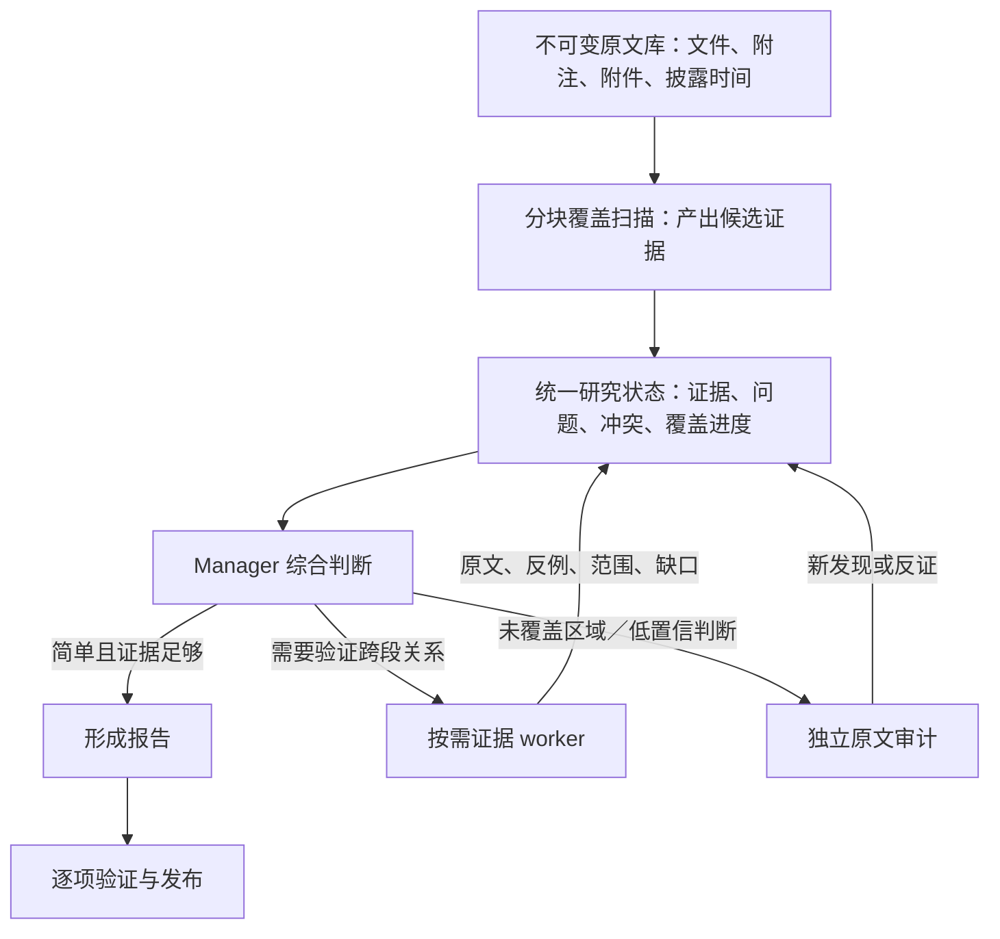

# 财报 Agent：集中推理与证据分工的取舍

研究日期：2026-09-14。本文为论文阅读与当前源码对照后的设计建议，未实施、未做架构对照实验。本文中的预算、样本数及路由规则是实验起点，不是论文证明的最优参数。

## 判断

建议采用“Manager 维护统一研究状态，证据 worker 按需读取原文，Manager 集中形成结论”。不建议保留固定的多层写作接力，也不建议每一步都把全部原文、历史报告和中间输出塞进一个不断增长的对话。

当前 subagent 更接近一次受约束的模型调用。它的潜在价值是隔离注意力、并行读取材料和局部失败重试；我们尚未证明当前 4–8 个写作节点比同预算的单 Manager 更有效。不能用单元测试通过来替代真实的披露发现质量评估。

## 相关研究与适用边界

| 研究 | 研究发现 | 对本系统的启示与边界 |
|---|---|---|
| [Towards a Science of Scaling Agent Systems（2025，本文读 v1）](https://arxiv.org/html/2512.08296v1) | 在多个任务与预算控制下，多 Agent 收益取决于任务依赖结构；可并行任务和顺序推理的结果不同。 | 证据搜集可并行，跨附注因果判断应集中。Finance-Agent 不是“开放式财报亮点发现”评测，不能搬用增益数字。 |
| [Why Do Multi-Agent LLM Systems Fail?（2025，本文读 v1）](https://arxiv.org/html/2503.13657v1) | 归纳任务设计、协作和验证等失效类型，改角色或拓扑的收益并不普遍稳定。 | 优先检查交接丢失、问题边界与终止规则。这是失效研究，不证明单 Agent 对所有任务更好。 |
| [Lost in the Middle（2023 预印本）](https://arxiv.org/abs/2307.03172) | 所测模型在长上下文中利用证据的能力受证据位置影响。 | “放进上下文”不等于“可靠地用到”。老模型实验不能直接量化当前生产模型的漏检率。 |
| [RAG or Long-Context LLMs?（EMNLP Industry 2024）](https://aclanthology.org/2024.emnlp-industry.66/) | 其问答实验中，资源充足时长上下文平均表现较好，检索方案成本更低，并提出混合路由。 | 必须加入强长上下文基线；不能预设检索或分工必胜。已知问题的问答与未知亮点发现不同。 |
| [Recursive Language Models（2025，本文读 v1）](https://arxiv.org/html/2512.24601v1) | 将长输入放在外部环境，按需检查和调用子模型；其长上下文任务实验显示这种设计有价值。 | 借鉴可访问原文与按需展开，不必照搬开放 Python 执行或深层递归。本文建议的受控文档工具尚未实测。 |

补充工程材料：[Anthropic 的多 Agent 研究系统](https://www.anthropic.com/engineering/multi-agent-research-system)。它支持将独立搜集任务并行化，也明确指出共享上下文依赖和成本问题。这是工程案例，不能视为本财报系统的因果证明。

## 当前实现中真正值得改的地方

1. **Manager 不是一个持续保持完整状态的会话。** `planPreparedSecFiling`、`reviewPreparedSecAnalysis`、`summarizePreparedSecFiling` 是不同模型调用，依靠 payload 交接。增加统一的持久化研究状态比仅扩大 token 窗口更直接。
2. **节点不能主动扩展证据。** `analyzePreparedSecNode` 接收选定原文及事实，不具备自主读取其他附注的工具循环。一个关键关联落在别的章节时，当前模式依赖后续补查。
3. **遗漏审校只能补已发现的项。** `auditDisclosureCoverage` 接收 discoveries 和节点正文，其返回 ID 还必须存在于原清单。扫描阶段漏检的主题没有从此路径恢复的机会。
4. **已存在一些共享证据能力。** Synthesis 接收发现原文引用、节点 facts、evidenceIds 和部分历史上下文；不是完全没有原文证据。但没有按需回读全文的能力，不能验证所有跨段关系。
5. **长耗时不能全归因于多 Agent。** 已观察到模型请求兼容错误、排队和超时。应分别测排队时间、成功推理时间、失败重试时间，再比较架构效率。

源码入口：
- [Manager／节点／合成](../workers/pipeline/src/sec/pipeline.ts)
- [披露扫描及遗漏审校](../workers/pipeline/src/sec/discovery.ts)
- [Workflow 编排](../workers/pipeline/src/workflow-core.ts)

## 推荐结构



### Manager 应维护什么

完整材料保存于外部证据库，不做不可逆的摘要替换。Manager 的工作上下文包含材料地图、重要证据、待回答问题和冲突记录；它能回读任意源段落。历史模型结论单独标识，不能升级为事实。

每项研究结论有独立的证据记录，例如：

```json
{
  "claimId": "asset-life-01",
  "question": "设备会计寿命是否与经营证据一致？",
  "sourceRefs": ["文件ID/起止位置"],
  "quotes": ["连续原文"],
  "sourceDate": "披露日期",
  "period": "所指财报期间",
  "status": "需要补证",
  "counterEvidenceRefs": [],
  "linkedClaimIds": [],
  "limitations": [],
  "nextCheck": "需要核对的证据"
}
```

这是外显的研究状态与证据摘要，不要求保存模型隐藏推理过程。

### worker 做什么

将“写一节报告”改为“解决一个有边界的证据问题”，允许以下受控读取动作：按位置读原文、取相邻上下文、搜索完整已采集材料、读取同口径历史原文。返回具体事实、引用、反证、检索范围和仍未解决的问题。

例如设备寿命 worker 核对会计估计及变更影响；交易计划 worker 核对人物、设立／修改／终止状态和有效期间；Manager 再整合与资本开支、现金流或治理有关的判断。所有事实绑定具体来源，不把某个人的职务或计划状态永久写死。

不默认每份财报派 4–8 个 worker。先用 0–3 个按需任务作为实验起点；分块覆盖读取和主题推理的调用数分别统计。预算根据证据复杂性和模型实际可靠上下文长度确定，不能把产品标称上限当可靠阈值。

### 审计必须能打开新的证据

审计不只检查候选清单；给它材料地图、尚未覆盖或低覆盖区段，以及独立取证能力。采用附注／其他事项／会计政策／合同等区域抽查，同时保留开放主题。没有新证据增量或达到明确预算时停止，保留未覆盖提示；同一模型换个角色并不自动产生独立判断。

“GPU 续约溢价”若只存在于尚未采集的电话会，任何内部编排都无法保证发现。将来源采集完整性和已采集材料内的发现能力分开评分。电话会结果不能作为只给 SEC 文件的测试中模型漏检项。

### 两个优先改造

- 优先一：统一证据／问题状态，Manager 与审计按证据 ID 回读原文。保留现有扫描和证据验证。
- 优先二：减少固定写作节点，变为按需取证；Manager 负责跨主题关系及最后成文。完整事件简析路线可继续轻量运行。

## 如何验证，避免再靠直觉选架构

先冻结 10–20 份跨季度财报作为小规模试验，ORCL 为回归样本，不只围绕已知两个答案调整。补充不带这些已知主题的留出公司与季度。不改线上追踪范围，评估材料独立存放。

比较三组：A 当前流水线；B 单 Manager 长上下文／回读工具；C 推荐的共享状态＋按需证据 worker。保持模型、材料、披露截止时间和输出约束一致，按相近总 token／成本预算比较；另做相同延迟预算比较。至少重复运行 3 次，记录波动。小样本只用来选方向，不作统计上已证明的声明。

人工先标注重要披露、可接受引用、人物与事件状态、关键反证，不能以当前 Agent 生成的清单作为标准答案。历史对照使用当时已公开的材料；财报日后取消交易计划等事件只能进入单独的“截至更新日”实验。

主指标：人工加权的重要披露召回率、发现准确率／无依据亮点比例、跨段关联正确率、时间与状态正确率。辅指标：原文引用支持度、反证覆盖、每项有效发现的 token／费用、P50/P95 延迟、重试耗时。文本扫描覆盖率不等于发现召回率。

逐步消融：去掉主题 worker、给 Manager 原文回读能力、允许审计发现新主题，分别测增量。复杂架构只有在预先设定的质量提升与成本约束下稳定获益才保留。

结论：优先检验“单 Manager 集中推理＋按需读取”基线；subagent 作为有证据增益的可选工具保留。当前没有实测依据宣称哪种架构已经更优。
