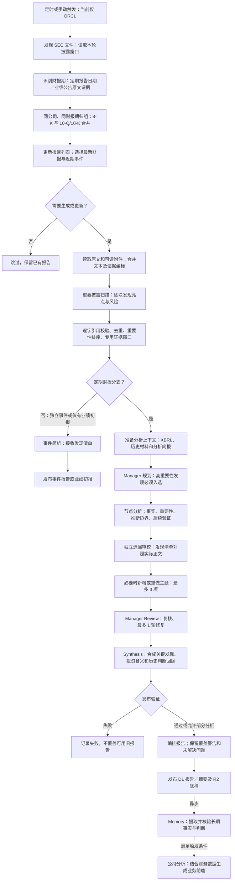

# SEC Agent 分析流程

按 2026-09-14 当前实现绘制。核心流程在 `workers/pipeline/src/workflow-core.ts`，披露发现与遗漏补查在 `workers/pipeline/src/sec/discovery.ts`。

## 关键边界

- “亮点”包括正面和负面：折旧／经济寿命、交易计划、定价与续约、合同约束、客户依赖等，不限于固定主题。
- 原文扫描每块 20,000 字符，重叠 800 字符，最多 64 块、并发 2；超预算或失败明确提示，不代表全材料已覆盖。
- 引用必须为 40–1600 字符的连续原文，绑定证据位置；不能把“计划出售”当成“已经出售”。
- 财报通常规划 4–8 个主题，最多 24 个；遗漏补查最多 3 项；Manager 修复最多 1 轮、3 项。
- 独立事件及仅有 8-K/6-K 的业绩初报走事件简析，不执行完整的节点／遗漏审校链；后续定期报告加入后转入合并财报分析。
- 有可靠原文发现但缺少 XBRL，可发布明确标注的部分分析；验证失败不发布新报告。
- 当前不自动获取完整电话会、独立 IR PDF/PPT。扫描覆盖率仅针对已采集文本。
- Memory 和公司业务前瞻是下游任务；财报发布成功不等于下游全部完成。

## 本轮跟踪

目标实例：`manual-ORCL-quarterly-20260913-jsonfix`。2026-09-14 检查时已进入重要披露扫描，部分块正在超时重试；这是一条检查快照，不是实时状态。
